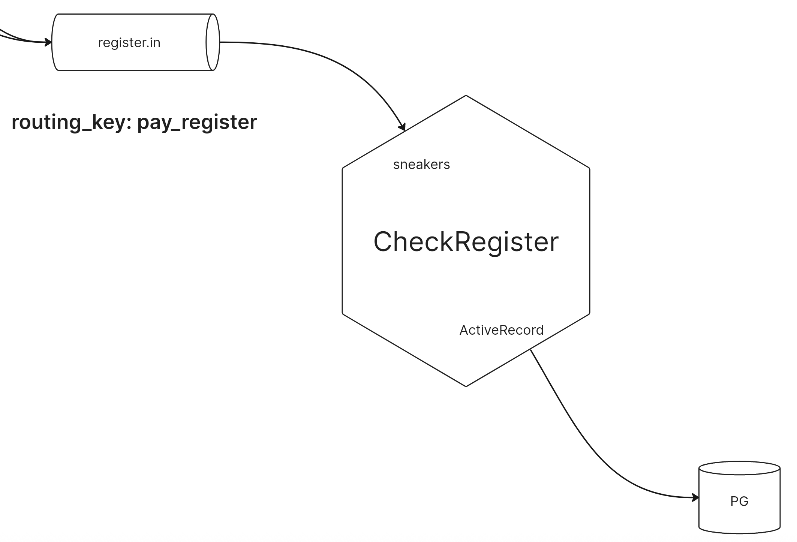

# CheckRegister

Микросервис для регистрации чеков в базе данных

## Архитектура



## Точки входа

Приложение имеет две точки входа. Пользователи могут обращаться к системе администрирования через HTTP, для этого запускается веб-сервер puma

```bash
bundle exec rails s
```

Кроме того, приложение слушает RabbitMQ-сообщения, для этого поднимается sneakers-обработчик 

```bash
bundle exec rails sneakers:run
```

## RabbitMQ

Панель управления RabbitMQ можно найти по ссылке http://localhost:15672/

## Запуск в docker

Подготовка

```bash
docker compose build
COMPOSE_DOCKER_CLI_BUILD=1 DOCKER_BUILDKIT=1 docker compose run -e "RAILS_ENV=development" check-register bundle exec rake db:drop db:create db:migrate
```

Запуск:

```bash
docker compose up
```

Доступ к командной строке:

```bash
docker compose exec -it check-register bash
```
