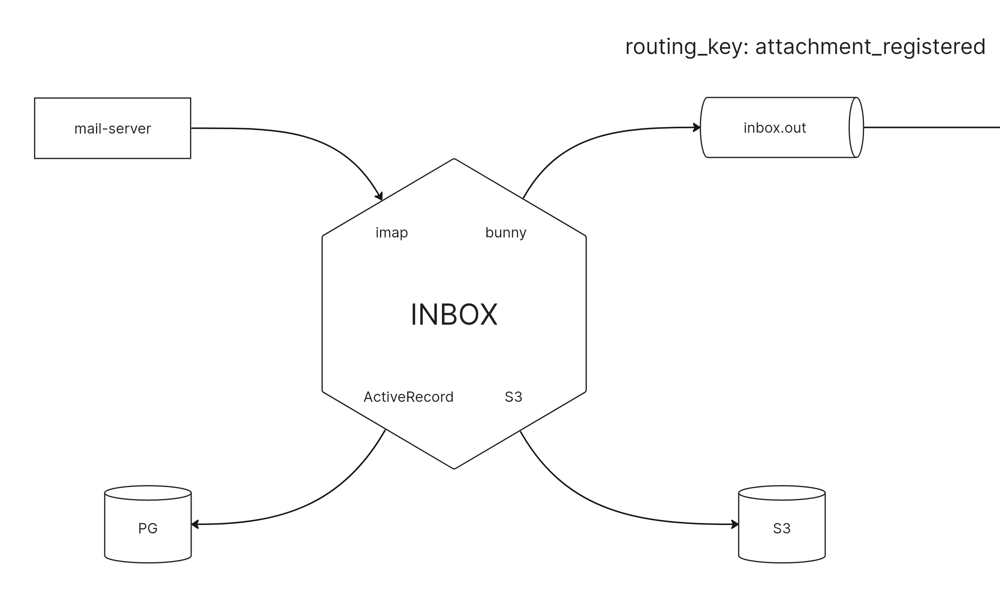

# inbox

Приложение для приема писем и последующей отправки их на обработку через очередь.

## Генерация приложения

Для генерации приложений используем nextgen

```bash
gem exec nextgen create inbox
```

## Архитектура



## Переменные окружения

На проекте используется гем dotenv, следовательно, переменные окружения ожидаются в файле .env (получить который легко путем переименования .env.sample).

### Настройка почтового ящика

Иногда требуется предварительная настройка почтового ящика. Если используется Яндекс, не забывайте получать для него отдельный пароль на странице [Яндекс.ID](https://id.yandex.ru/) => [Безопасность](https://id.yandex.ru/security) => [Пароли приложений](https://id.yandex.ru/security/app-passwords). Заводим новый пароль для Почты (IMAP, POP3, SMTP), в качестве логина будет выступать ваш email, а пароль сгенерирует для вас yandex (и покажет только один раз).

Кроме того, в настройках почтовых программ необходимо включить [настройку "Пароли приложений и OAuth-токены"](https://olegon.ru/showthread.php?t=38073).

Переменные кружения для взаимодействия с почтовым сервером:

INBOX_IMAP_SERVER - адрес почтового IMAP-сервера, в случае Yandex - imap.yandex.ru
INBOX_IMAP_PORT - порт почтового сервера, стандартный порт для IMAP - 993
INBOX_IMAP_EMAIL - адрес электронной почты (email)
INBOX_IMAP_PASSWORD - пароль от электронной почты

### Настройка RabbitMQ

RABBITMQ_HOSTS_JSON - хосты RabbitMQ (['host1', 'host2'])
RABBITMQ_VHOST - изолированный vhost-контур RabbitMQ
RABBITMQ_USER - пользователь RabbitMQ
RABBITMQ_PASSWORD - пароль пользователя RabbitMQ

## Периодическое фоновое извлечение почтовых уведомлений

Автоматизировать извлечение почтового уведомления проще всего при помощи рекуррентных задач solid_queue, о которых детальнее можно почитать по [ссылке](https://github.com/rails/solid_queue#recurring-tasks).

### Установка solid_queue в проекте

Устанавливаем гем solid_queue

```bash
gem 'solid_queue'  
```

Выполняем первичную установку solid_queue

```bash
bundle exec rails solid_queue:install
```

Так как будем запускать переодические задачи в том числе в development-окружении, вносим изменения в config/environments/development.rb

```ruby
  # Replace the default in-process and non-durable queuing backend for Active Job.
  config.active_job.queue_adapter = :solid_queue
  config.solid_queue.connects_to = { database: { writing: :queue } }
  config.solid_queue.logger = ActiveSupport::Logger.new('log/active_job.log')
```

Кроме того, необходимо добавить в config/database.yml в development-окружение название базы данных под solid_queue (в них развенутся миграции из config/queue_schema.rb)

```yaml
development:
  primary: &primary_development
    <<: *default
    database: inbox_development
  queue:
    <<: *primary_development
    database: inbox_development_queue
    migrations_paths: db/queue_migrate
```

### Создаем рекурентную задачу на извлечение писем из почтового ящика

Для этого воспользуемся job-генератором:

```bash
bundle exec rails g job extract_email
```

Добавляем в сгененированную задачу временную заглушку (app/jobs/extract_email_job.rb)

```ruby
class ExtractEmailJob < ApplicationJob
  queue_as :default

  def perform(*args)
    logger.info "######################################"
    logger.info Time.zone.now
    logger.info "######################################"
  end

  def logger
    Rails.application.config.solid_queue.logger
  end
end
```

Добавляем в config/recurring.yml задачу на запуск ExtractEmailJob каждую минуту

```yaml
development:
  extract_email_every_minute_jobs:
    class: ExtractEmailJob
    schedule: every minute
```

### Запуск переодических задач

```bash
bin/jobs
```

## Работа с изображениями

### YandexCloud

Инструкция по работе с S3-хранилищем в [YandexCloud](https://yandex.cloud/ru/docs/storage/s3/s3-api-quickstart)

Создаем сервисный аккаунт

```bash
yc iam access-key create --service-account-name igorsimdyanov
```

### Обработка изображений

Подключаем в Gemfile [carrierwave](https://github.com/carrierwaveuploader/carrierwave)
Его пришлось пропатчить из-за ошибки [carrierwave](https://github.com/igorsimdyanov/carrierwave-aws)

```ruby
# Загрузка файлов
gem 'carrierwave'
# Используем пропатченную версию до исправления следующего issue
# https://github.com/carrierwaveuploader/carrierwave-aws/issues/190
gem 'carrierwave-aws', git: 'https://github.com/igorsimdyanov/carrierwave-aws.git'
gem 'carrierwave-i18n'
```

В config/initializers/carrierwave.rb добавляем инициализацию гема [carrierwave-aws](https://github.com/carrierwaveuploader/carrierwave-aws)

```ruby
CarrierWave.configure do |config|
  config.storage    = :aws
  config.aws_bucket = ENV.fetch('S3_BUCKET_NAME')
  config.aws_acl    = 'private'

  # Optionally define an asset host for configurations that are fronted by a
  # content host, such as CloudFront.
  config.asset_host = "https://#{ ENV.fetch('S3_URL') }"

  # The maximum period for authenticated_urls is only 7 days.
  config.aws_authenticated_url_expiration = 60 * 60 * 24 * 7

  # Set custom options such as cache control to leverage browser caching.
  # You can use either a static Hash or a Proc.
  config.aws_attributes = -> { {
    expires: 1.week.from_now.httpdate,
    cache_control: 'max-age=604800'
  } }

  config.aws_credentials = {
    endpoint:          ENV.fetch('S3_URL'),
    access_key_id:     ENV.fetch('S3_ACCESS_KEY_ID'),
    secret_access_key: ENV.fetch('S3_SECRET_ACCESS_KEY'),
    region:            ENV.fetch('S3_REGION'), # Required
    stub_responses:    Rails.env.test? # Optional, avoid hitting S3 actual during tests
  }
end
```

Генерируем аплоадер:

```bash
bundle exec rails g uploader Attachment
```

Изменяем содержимое аплоадера (app/uploaders/attachment_uploader.rb):

```ruby
class AttachmentUploader < CarrierWave::Uploader::Base
  storage :aws

  def filename
    "attachment_#{SecureRandom.uuid}.#{file.extension}"
  end

  def store_dir
    "#{model.class.to_s.underscore}/#{model.id}"
  end
end
```

Создаем модель Attachment

```bash
bundle exec rails g model attachment file:string:uniq
bundle exec rails db:migrate
```

И подключаем в нее ранее созданный AttachmentUploader

```ruby
class Attachment < ApplicationRecord
  mount_uploader :file, AttachmentUploader
end
```

### Rake-задача на загрузку файла

Создаем модель rake-задачу

```bash
bundle exec rails g task upload check
```

Вносим изменения в rake-задачу (lib/tasks/upload.rake)

```ruby
namespace :upload do
  desc 'Загрузка чека в S3-хранилище'
  task check: :environment do
    attach = Attachment.new
    File.open(Rails.root.join('spec/fixtures/check001.jpeg')) do |f|
      attach.file = f
    end
    attach.save!
  end
end
```

Выполняем загрузку чека в S3-хранилище

```bash
bundle exec rails upload:check
```

## Сериализация данных

Для формирования data-сообщения, которое отправляется через Bunny, формируем data-объект. Для этого используем сериалайзер [alba](https://github.com/okuramasafumi/alba). Добавляем гем в Gemfile:

```ruby
gem 'alba'
```

## Отправки данных через RabbitMQ

Для отправки данных через RabbitMQ используем гем Bunny. Добавляем гем в Gemfile:

```ruby
gem 'bunny'
```

## Запуск в docker

Подготовка

```bash
docker compose build
COMPOSE_DOCKER_CLI_BUILD=1 DOCKER_BUILDKIT=1 docker compose run -e "RAILS_ENV=development" inbox bundle exec rake db:drop db:create db:migrate
```

Запуск:

```bash
docker compose up
```

Доступ к командной строке:

```bash
docker compose exec -it inbox bash
```
