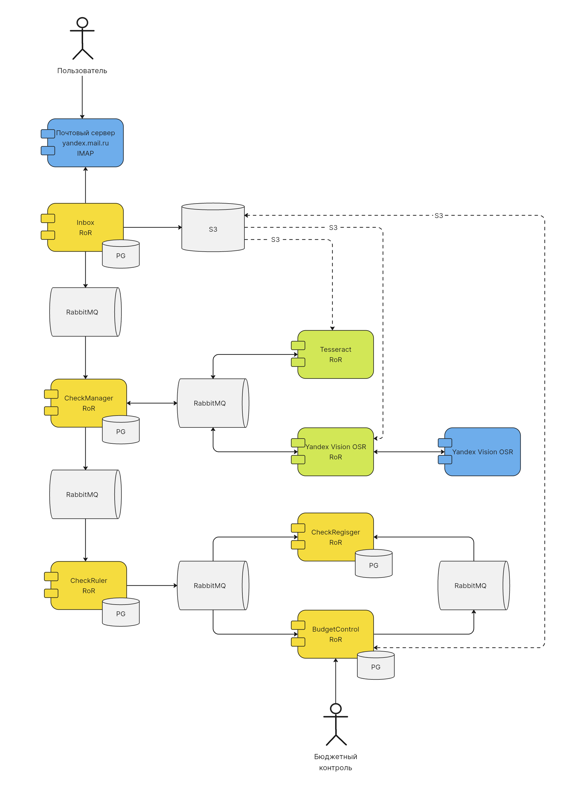

# Workshop по событийной архитектуре

Для генерации приложений используем nextgen

```
gem exec nextgen create inbox
```

## Архитектура

Приложение состоит из 7 приложений:

- inbox
- check-manager
- tesseract
- yandex-vision
- check-ruler
- budget-control
- check-register

В качестве исходного дата-объекта выступает письмо с вложением (товарным чеком), которое читает первый микросервис inbox. Далее вложение проходит через цепочку микросервисов, подвергается распознаванию и в конце-концов регистрируется в микросервисе check-register.

Диаграмма компонентов по совместительству является и диаграммой развертывания:

