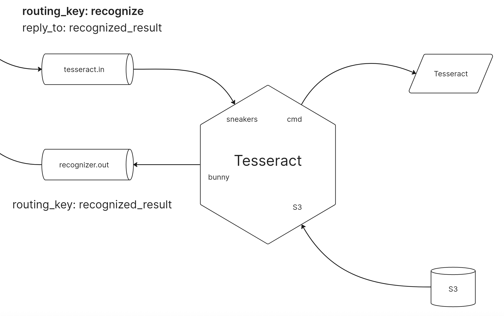

# Tesseract

Микросервис, который распознает текст на изображении и передает его отправителю по каналу reply_to

## Архитектура



## Точки входа

Приложение имеет лишь одну точку входа: слушает RabbitMQ-сообщения, для этого поднимается sneakers-обработчик 

```bash
bundle exec rails sneakers:run
```

## RabbitMQ

Панель управления RabbitMQ можно найти по ссылке http://localhost:15672/

## S3-хранилища

Проект ожидает следующие переменные окружения:

* S3_URL - адрес S3-хранилища (например, https://storage.yandexcloud.net)
* S3_BUCKET_NAME - бакет S3-хранилища (например, inbox.simdyanov.ru)
* S3_ACCESS_KEY_ID - идентификатор для входа в S3
* S3_SECRET_ACCESS_KEY - пароль для входа в S3
* S3_REGION - регион S3-хранилища (например, aws:amz:ru-central1:s3)

## Запуск в docker

Подготовка

```bash
docker compose build
```

Запуск:

```bash
docker compose up
```
